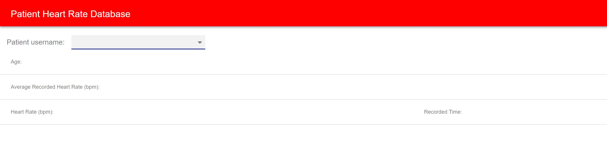
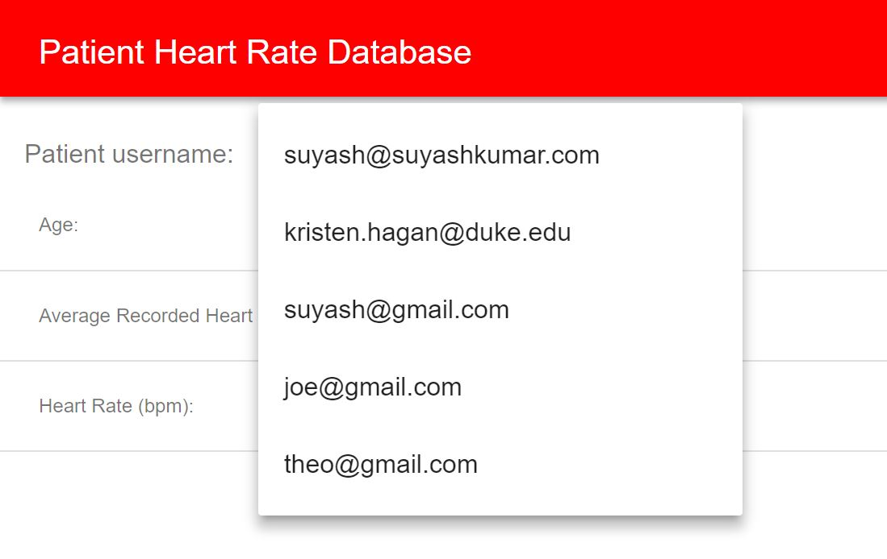
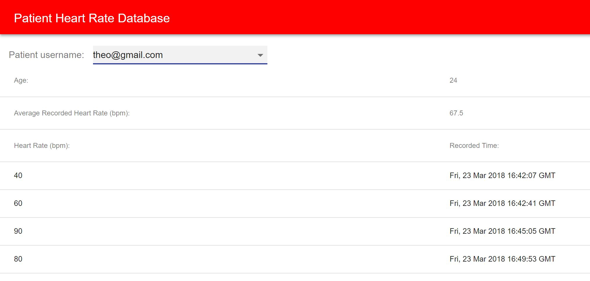

# doctor-hr-frontend
### HeartRate Database Viewer - React Application

##### Description: 
This React Application retrieves and displays a selected patient's information- including age, average heart rate, and all documented heart rates and their recording times. To select a patient, use the dropdown menu of all patient email addresses saved in the database. The selection of an email address will complete and render the data table of heart rates and their corresponding recording times. Upon selection of a new patient, the data table of new information will render. 

Example display images: 
 


##### Installation: 
Frontend application code using react to interact with codebase from repo called heart_rate_database_information BME590 Databases Assignment (which can be found [here](https://github.com/hagankristen/heart_rate_databases_introduction)). 

To start this app,  first get the mongodb program running. After installing docker on the VM (provided by Duke University), simply run: 
```
docker run -v $PWD/db:/data/db -p 27017:27017 mongo
```

On the local machine, clone the repo linked above and run the following lines 

```
virtualenv env
source env/bin/activate
pip install -r requirements.txt
```

After the required libraries are installed, run the heart_db_server.py APIs with

```
FLASK_APP=heart_db_server.py flask run
```

:eyes: Double check that API urls and VM address coincide and will connect properly. 

Clone this doctor-hr-frontend repo. 
The final setup step requires installing NodeJS and ReactJS, refer to [this link] (https://github.com/mlp6/Medical-Software-Design/blob/master/Lectures/react/setup.md) for basic setup help. 

Open the Node command line. This app uses components from Material IU, so install the dependencies by running: 
```
cd doctor-hr-frontend
cd my-app/
npm install material-ui@next
npm install axios 
```

:eyes: Double check that urls for axios get requests in DisplayUserMenu.js are correct. 

Then, launch the application in Google Chrome: 
```
npm run start
```


 
